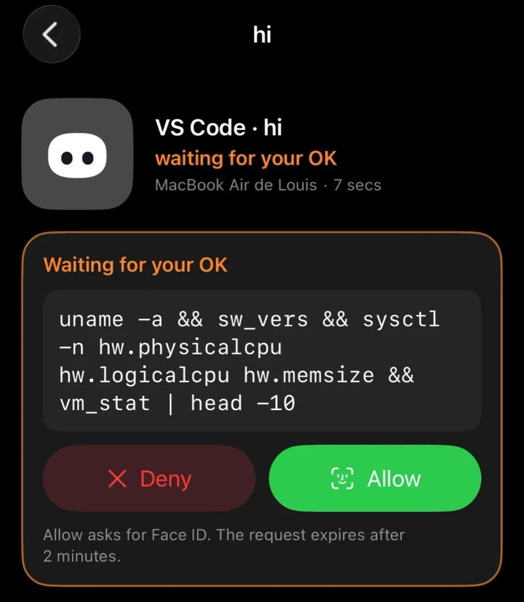
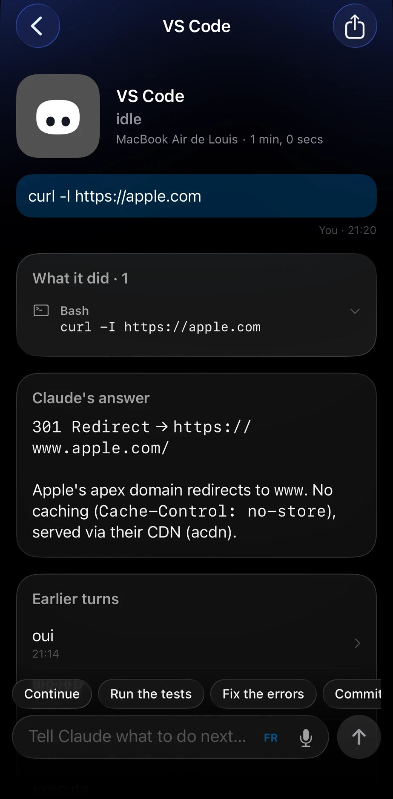
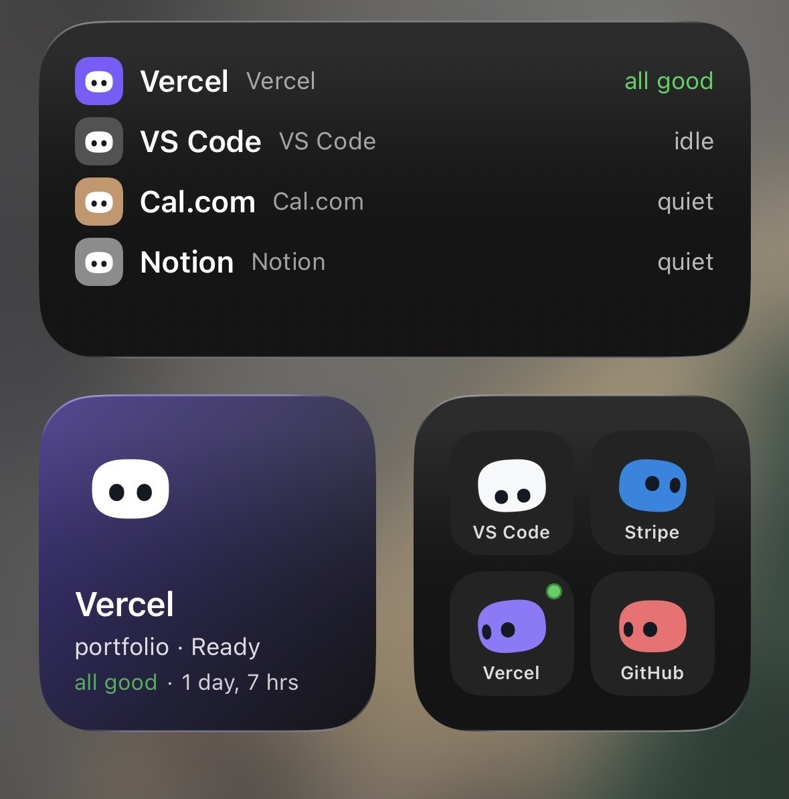

<div align="center">


# Coucou

**A tiny friend that lives in your Mac's notch — or at the top of your screen on Windows and Linux — and keeps an eye on your AI coding agent sessions. And now on your iPhone too.**

Approve permissions, watch your agents work, drop a file, chat with Claude — all without leaving what you're doing. Walk away from your Mac and Mochi follows you to your iPhone: Lock Screen, Dynamic Island, widgets, Siri.

[](https://github.com/Louis-CFM/coucou/releases)


</div>

---

## Why

Some studios showed off gorgeous notch companions… and never let anyone use them.
**Coucou is the open version.** Every line of code, every animation, every sound — free to use, read, fork and remix.

Meet **Mochi**: a soft little squircle with big eyes that pops out of your notch, waves hello, follows your cursor with its eyes, gets annoyed when you poke it (and dizzy if you insist), and tells you the moment Claude Code needs you.

## Features

- 🤖 **Claude Code, Cursor, Codex, Gemini CLI, Antigravity and other agents, live** — see every session in your notch: what it reads, edits and runs, step by step. Tag a hook payload with `coucou_agent` to give any agent its own pill (see [`docs/AGENTS.md`](docs/AGENTS.md)). Finished? Mochi does a happy little jump.
- See what Claude is editing, live in the notch: each file modification shows the file name and +N −M counts in the ticker, tap to read the full diff
- ✅ **Approve and answer from the notch** — Claude Code permission requests show up with **Allow / Deny / Always**; `AskUserQuestion` prompts show the choices right in the notch (single or multi-select, up to 4 questions). One click, or "Reply in terminal" to fall back to the CLI. Codex also gets Allow / Deny.
- 🧑‍💻 **Jump to the right terminal** — open the exact terminal window of a session *(macOS)*.
- 💬 **Chat with Claude, Gemini, OpenAI, or a local model (Ollama / LM Studio)** — click the model name above the chat box to switch provider and pick a model. Cloud providers use your own API key; local providers connect to a server running on your Mac. *(Gemini, OpenAI and local models: macOS)*
- 📊 **Claude plan usage** *(macOS, GitHub build)* — a small pill in the notch header shows your 5-hour and weekly Claude plan limits. Enable it from Settings → Agents → Plan usage. Pro and Max plans only.
- 📋 **Declare the tools you use** — open Settings → Active pills and pick your main workspace tool (VS Code, Cursor, Codex or Antigravity), then toggle up to 4 more: Gemini CLI, Anthropic, Google AI, OpenAI, Ollama, LM Studio and service integrations *(macOS)*.
- 📎 **Drop a file on the notch** — Mochi turns into a box and swallows it, then ask a question about it or send it by email *(email: macOS, Mail.app)*.
- 🖥️ **Mochi on the desktop** — drag Mochi out of the island to set him loose on your desktop: he floats as a 120 pt companion, follows your cursor, wears his outfit, reacts to alerts by flying home and flying back, and comes back where you left him on next launch.
- 🪟 **Drag Mochi onto any window** — attach that window as context for Claude *(macOS)*.
- 🔌 **Integrations** — Stripe payments, n8n workflows, GitHub (open PRs, reviews requested, CI status), Vercel deployments, Resend emails, Notion, Cal.com. Each one gets its own little colored Mochi.
- 🎵 **Apple Music pill** *(macOS, GitHub build)* — add the Apple Music pill in Settings → Active pills to see what's playing and control playback from the notch; Mochi dances while it plays.
- 👗 **Dress Mochi up** — right-click him for the wardrobe. He also dresses up for the seasons on his own.
- ⌨️ **Keyboard shortcuts** — open the chat, jump to an alert or a terminal, switch pills, mute, send Mochi to the desktop or open the wardrobe from anywhere; all customizable in Settings → Shortcuts.
- 🎭 **A real character** — idle breathing, blinks, eyes on a sphere that follow your mouse, emotes, 28 handcrafted sounds, a greeting on launch.
- 🫥 **Invisible when idle** — hides away when nothing is running, peeks out when you hover the notch (the top edge of the screen on Windows and Linux).
- 🖥️ **Any Mac, notch or not** — on an iMac, a Mac mini, or a MacBook with its lid closed on an external display, Mochi sits in a small bar at the top of the screen.
- 📱 **Coucou on iPhone** — your sessions, approvals and services in your pocket, with Live Activities, widgets and Siri. See [Coucou on iPhone](#coucou-on-iphone).
- 🔒 **Private by design** — no telemetry, no account. Keys live in your macOS Keychain, Windows Credential Manager or Linux Secret Service (GNOME Keyring, KWallet). The app only talks to the services you plug in.

## Coucou on iPhone

The Mac app does the work; the iPhone app keeps you in the loop when you step away. It goes as far into the Apple ecosystem as a dev tool can:

<table>
<tr>
<td colspan="3" align="center"></td>
</tr>
<tr>
<td width="33%"></td>
<td width="33%"></td>
<td width="33%"></td>
</tr>
</table>

- 🏝️ **Live Activity and Dynamic Island** — lock your Mac while an agent works and Mochi moves to your iPhone's Lock Screen and Dynamic Island with the agent's state, then comes back to the notch when you unlock. **Allow** or **Deny** a permission right from the Lock Screen, without opening the app.
- 🔔 **Notifications you can act on** — Allow, Review or Deny a permission, pick an answer to Claude's question, or reply to a finished agent, straight from the notification.
- 🔐 **Face ID on every Allow** — nothing runs on your Mac without your explicit tap; your Mac only applies a decision meant for the exact request it is waiting on.
- 💬 **Talk to your agents** — follow each session live (steps, diffs, the last turn), answer questions, and send the next instruction to your Mac by text or voice.
- 🧩 **Widgets, Control Center, Siri and Shortcuts** — home and Lock Screen widgets, a Control Center control, ask Siri how your agents are doing or send Claude an instruction, in Siri and Shortcuts.
- 🔎 **Spotlight and Focus** — find past turns in Spotlight; a Focus filter shows only the agents waiting for you.
- 📊 **Your services up close** — GitHub, Vercel, Stripe, Cal.com, n8n, Notion, Resend: your Mac reads their APIs with the keys in its Keychain and the iPhone shows the figures and lists. Safe actions (re-run CI, redeploy, merge a PR, pause a workflow) behind Face ID; nothing that moves money or sends an email.
- 🫧 **Liquid Glass, native to the bone** — SwiftUI, tabs, zoom transitions, context menus, swipe actions, alternate icons, Mochi at 120 Hz.
- 🔒 **Through your own iCloud** — sessions sync through your private CloudKit database; project names, commands and questions are encrypted with your iCloud keys. No Coucou server sees your projects, commands or keys. Turn it on in the Mac app: Settings → General → iPhone.

**Get it on your iPhone in 3 steps:** install Coucou on your iPhone ([Join the TestFlight beta](https://testflight.apple.com/join/3GpeHv2b) — free, App Store coming soon), turn on **Settings → General → iPhone** in the Mac app (0.1.8 or later), and use the same Apple Account in iCloud on both. Full guide, troubleshooting and build-it-yourself: [docs/IPHONE.md](docs/IPHONE.md).

<table>
<tr>
<td></td>
<td></td>
</tr>
<tr>
<td></td>
<td></td>
</tr>
</table>

## Versions

macOS releases are published as `v*` tags. See [CHANGELOG.md](CHANGELOG.md) for the full notes of each version.

| Version | Date | Highlights |
|---------|------|------------|
| [0.1.8](https://github.com/Louis-CFM/coucou/releases/tag/v0.1.8) | Oct 5, 2026 | Coucou on iPhone: sessions, widgets, approvals with Face ID, Mochi in the Dynamic Island |
| [0.1.7](https://github.com/Louis-CFM/coucou/releases/tag/v0.1.7) | Oct 4, 2026 | Keyboard shortcuts |
| [0.1.6](https://github.com/Louis-CFM/coucou/releases/tag/v0.1.6) | Oct 4, 2026 | Mochi on the desktop |
| [0.1.5](https://github.com/Louis-CFM/coucou/releases/tag/v0.1.5) | Oct 4, 2026 | Wardrobe and seasonal outfits, new launch greeting |
| [0.1.4](https://github.com/Louis-CFM/coucou/releases/tag/v0.1.4) | Oct 3, 2026 | Live diffs, GitHub pull requests, CI, reviews and contribution grid |
| [0.1.3](https://github.com/Louis-CFM/coucou/releases/tag/v0.1.3) | Oct 3, 2026 | Answer Claude's questions from the notch, plan usage, local models, Apple Music |
| [0.1.2](https://github.com/Louis-CFM/coucou/releases/tag/v0.1.2) | Oct 2, 2026 | Codex and Cursor support, the permission card stays until you answer |
| [0.1.1](https://github.com/Louis-CFM/coucou/releases/tag/v0.1.1) | Oct 2, 2026 | Gemini and OpenAI chat, Linux build, more agents and pills, security hardening |
| [0.1.0](https://github.com/Louis-CFM/coucou/releases/tag/v0.1.0) | Sep 27, 2026 | First release: Mochi, Claude Code sessions, chat, file drop, integrations |

Windows 0.1.1 and Linux 0.1.1 (beta) are in Releases under the `windows-v*` and `linux-v*` tags.

## Install

### App Store

Coucou is coming to the **Mac App Store** and the **iPhone App Store**: one click to install, automatic updates, and the iPhone app pairs with your Mac through your iCloud account, with nothing to configure. The links will be here as soon as Apple publishes them.

The App Store build of the Mac app runs in Apple's sandbox, so a few features stay in the GitHub build: Claude plan usage, the Apple Music pill and attaching the front window to the chat.

### iPhone

1. **Install Coucou on your iPhone** (iOS 18 or later): install [TestFlight](https://apps.apple.com/app/testflight/id899247664) from the App Store, then [Join the TestFlight beta](https://testflight.apple.com/join/3GpeHv2b). The beta is free; Apple limits it to 10,000 testers. The App Store version is coming soon.
   *Apple is reviewing the beta: it opens within a day or two — if the link isn't accepting testers yet, check back soon.*
2. **On your Mac**, with Coucou 0.1.8 or later: **Settings… → General → iPhone**, turn on **Show my agent sessions on my iPhone**, and **Move Mochi to my iPhone's Dynamic Island when my Mac is locked** for the Lock Screen.
3. **Same Apple Account** in iCloud on the Mac and the iPhone. That's the whole link: no account, no pairing code.
4. Open Coucou on the iPhone, allow notifications, and start a Claude Code session on the Mac.

Everything else, troubleshooting included, is in [docs/IPHONE.md](docs/IPHONE.md).

### Download for macOS

1. Grab the latest `Coucou.zip` from [Releases](https://github.com/Louis-CFM/coucou/releases).
2. Unzip and move **Coucou.app** to `/Applications`.
3. Launch it, and click **Open** when macOS asks you to confirm. Updating from 0.1.0? macOS may ask you, once for each key you saved, to let Coucou use it: enter your Mac password and click **Always Allow**.

### Windows

The Windows installer is **temporarily unavailable**. Microsoft Defender wrongly
flags the unsigned installer as malware; a false-positive report is under review
at Microsoft and the installer will come back once it is cleared and signed.
Until then you can [build it from source](#build-from-source).

There is no notch on a PC, so the island slides out of the top edge of the screen
instead of hiding inside one. See [`windows/README.md`](windows/README.md) for the
rest of the differences.

### Linux

The first Linux build is out as a beta: download it from [Coucou for Linux 0.1.1 (beta)](https://github.com/Louis-CFM/coucou/releases/tag/linux-v0.1.1), x86_64 only for now. Later versions will be in [Releases](https://github.com/Louis-CFM/coucou/releases) under `linux-v*` tags.

- **AppImage** (any distribution): `chmod +x Coucou-Linux-*.AppImage`, then run it.
- **Debian / Ubuntu**: `sudo apt install ./Coucou-Linux-*.deb`
- **Fedora / openSUSE**: `sudo dnf install ./Coucou-Linux-*.rpm`

Check a download with `sha256sum -c SHA256SUMS --ignore-missing`. Gemini CLI, Antigravity, Google AI, OpenAI and local model (Ollama / LM Studio) chat are macOS only for now.

The island sits on the top edge on compositors with layer-shell — COSMIC, KDE
Plasma, Hyprland, Sway and other wlroots compositors. GNOME has no layer-shell,
so there it opens as a regular window. See [`windows/README.md`](windows/README.md#linux).

### Build from source

**macOS** — requirements: macOS 15+, Xcode 16+, [XcodeGen](https://github.com/yonaskolb/XcodeGen).

```bash
brew install xcodegen
git clone https://github.com/Louis-CFM/coucou.git
cd coucou/NotchBuddy
xcodegen
open NotchBuddy.xcodeproj   # then ⌘R
```

**Windows** — requirements: [Rust](https://rustup.rs), Node 20+, MSVC build tools.

```powershell
git clone https://github.com/Louis-CFM/coucou.git
cd coucou/windows
npm install
npm run pack                # installer lands in windows/release/
```

**Linux** — requirements: [Rust](https://rustup.rs), Node 20+, and the WebKitGTK,
gtk-layer-shell and appindicator development packages (Debian/Ubuntu names below).

```bash
sudo apt install build-essential pkg-config \
  libwebkit2gtk-4.1-dev libgtk-layer-shell-dev libayatana-appindicator3-dev \
  librsvg2-dev libssl-dev libdbus-1-dev patchelf \
  gstreamer1.0-plugins-base gstreamer1.0-plugins-good
git clone https://github.com/Louis-CFM/coucou.git
cd coucou/windows
npm install
npm run pack                # AppImage, .deb and .rpm land in windows/release/
```

## Setup

Click the Coucou icon in the menu bar (macOS) or in the system tray (Windows, Linux) → **Settings…**

| What | Why | Where the key goes |
|---|---|---|
| **Claude Code hooks** | live sessions and approvals | **Install hooks** — Coucou backs up `~/.claude/settings.json`, merges its hooks and shows you the diff before writing anything |
| **Claude plan** *(macOS, GitHub build)* | Plan usage gauge in the notch header | **Install relay** in Settings → Agents → Plan usage, then enable "Show in the notch" |
| **Gemini CLI hooks** *(macOS)* | Gemini CLI sessions in the island | **Install hooks** in Settings → Gemini CLI — backs up `~/.gemini/settings.json` |
| **Antigravity (agy) hooks** *(macOS)* | agy sessions in the island | **Install hooks** in Settings → Antigravity — backs up `~/.gemini/config/hooks.json` |
| **Anthropic API key** | chat and questions about files | Settings → Anthropic API · Keychain / Windows Credential Manager / Secret Service |
| **Google AI API key** *(macOS)* | chat with Google AI (Gemini) | Settings → Chat — other providers · Keychain |
| **OpenAI API key** *(macOS)* | chat with OpenAI | Settings → Chat — other providers · Keychain |
| **Ollama server** *(macOS)* | chat with local models via Ollama | Settings → Chat → Local models → **Connect** |
| **LM Studio server** *(macOS)* | chat with local models via LM Studio | Settings → Chat → Local models → **Connect** |
| **iPhone** *(macOS)* | sessions, approvals, questions and Mochi on your iPhone | Settings → General → iPhone · your private iCloud, see [docs/IPHONE.md](docs/IPHONE.md) |
| **Active pills** *(macOS)* | choose which tools and agents appear in the island | Settings → Active pills |
| Stripe, n8n, GitHub, Vercel, Resend, Notion, Cal.com | the service pills | Keychain / Windows Credential Manager / Secret Service, all optional |

If Coucou isn't running, the hook exits immediately: **Claude Code is never blocked.**

## Things to try

| Do this | Mochi does that |
|---|---|
| Hover the notch (top edge on Windows and Linux) | peeks out and says hi 👋 |
| Click it | opens |
| Hover Mochi | blinks, eyes grow |
| Click Mochi | squish + annoyed |
| Click 3 times fast | 😵‍💫 dizzy for a few seconds |
| Drag a file onto the island | turns into a box and swallows it |
| Drag Mochi onto a window *(macOS)* | attaches it as context |
| Click the model name above the chat box *(macOS)* | switch AI provider or model |

## How it works

**macOS**

- **Island**: a borderless `NSPanel` hugging the notch, driven by a small state machine (`hidden → petit → home`).
- **Character**: drawn in SwiftUI `Canvas` + `TimelineView` at 60 fps — squircle body, eyes projected on a sphere, spring animations. No Rive, no Lottie, no images.
- **Claude Code**: a tiny `nb-hook` script receives hook events and forwards them over a Unix socket to the app. For approvals it waits for your click, then answers the hook.
- **Integrations**: lightweight pollers, paused when nothing is watching.
- **Declared pills**: `PillCatalog.swift` is the single source of truth — every pill (coding tools, agents, AI providers, services) is declared there with its ID, color and category.
- **Sounds**: 28 short WAVs played through preloaded `AVAudioPlayer`s.

The macOS app is native Swift 6 / SwiftUI / AppKit with **zero third-party dependencies**.

**iPhone**

- A native SwiftUI app sharing Mochi's engine, the pills and the diff engine with the Mac through `CoucouKit`.
- The Mac publishes sessions, turns and services to a private CloudKit zone in your iCloud (sensitive fields encrypted with your iCloud keys); the iPhone reads them and writes back decisions, answers and instructions, which the Mac only applies when they match what it is waiting on.
- Live Activities are started and updated by APNs pushes through [`relay/`](relay/), a stateless Cloudflare Worker that holds the APNs key and only sees the agent's name and state.

**Windows**

- A [Tauri 2](https://tauri.app) app (Rust + TypeScript): the island is a transparent, always-on-top window that never steals focus, Mochi is drawn in Canvas 2D with the same shapes, timings and sounds as on the Mac.
- Claude Code hooks go through a tiny `coucou-hook.exe` and a named pipe; keys live in Windows Credential Manager.
- Details and differences in [`windows/README.md`](windows/README.md).

**Linux**

- The same Tauri app as Windows. On Wayland the island is a gtk-layer-shell
  overlay anchored to the top edge, and click-through is its input region.
- Claude Code hooks go through the same `coucou-hook`, over a Unix socket in
  `$XDG_RUNTIME_DIR`; keys live in the Secret Service.

## Contributing

Issues and PRs are very welcome — new integrations, new emotes, new sounds, bug fixes. See [CONTRIBUTING.md](CONTRIBUTING.md).

## Credits

Built by [Louis Raillé](https://louisraille.fr) with Claude Code.
Inspired by the notch-companion concepts shared by design studios — this project is independent and not affiliated with any of them.

## License

- **Code:** [MIT](LICENSE) — use it, fork it, learn from it, just keep the copyright notice.
- **Name, Mochi character, icon, sounds and media:** © Louis Raillé, all rights reserved — see [LICENSE-ASSETS.md](LICENSE-ASSETS.md). Shipping your own fork? Give it your own name and character.

<div align="center">

**If Mochi made you smile, a ⭐ helps a lot.**

[Website](https://louis-cfm.github.io/coucou/) · [Privacy](https://louis-cfm.github.io/coucou/privacy.html) · [Terms](https://louis-cfm.github.io/coucou/terms.html) · [Support](https://louis-cfm.github.io/coucou/support.html)

</div>
